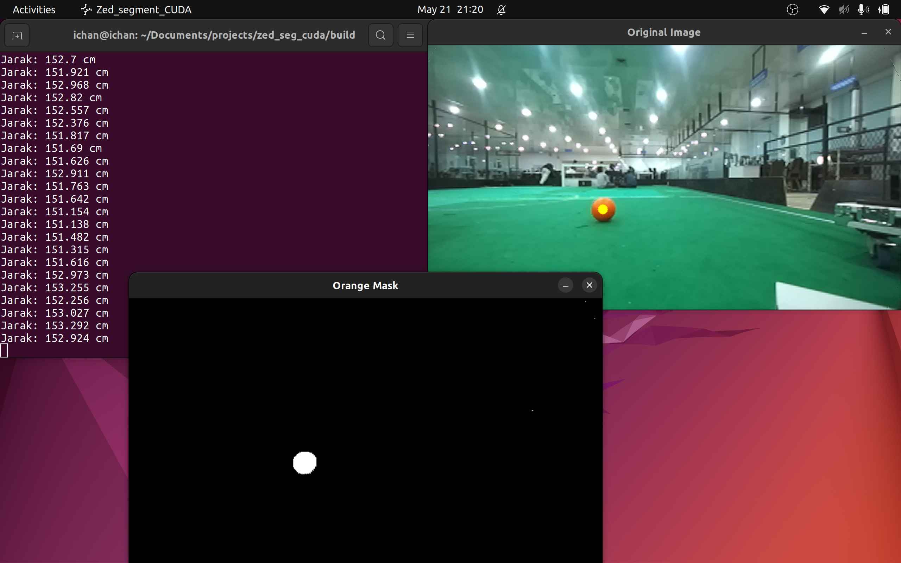

### Requirements

- ZED SDK

- ZED Camera (ZED / ZED Mini / ZED 2)

- OpenCV

- CUDA Toolkit

- CMake

### Build & Run

    git clone https://github.com/ichsanyudika12/zed-cuda-seg.git
    cd zed-cuda-seg
    mkdir build && cd build
    cmake ..
    make
    
    ./main

### Results

